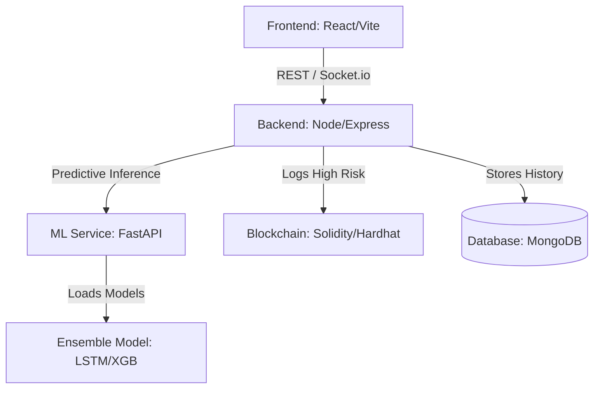

# Decentralized Traffic Emission Tracking and Predictive Pollution Management System

## Overview
This is a production-ready, full-stack platform that integrates Machine Learning, Blockchain, a Node.js backend, and a modern React frontend to provide real-time emission tracking and predictive pollution management.

## 🌟 Key Features
- **AI Forecasting Engine**: Utilizes an advanced Ensemble Machine Learning model (LSTM + XGBoost + Meta Learner) to predict PM2.5 levels.
- **Blockchain Verification**: Logs hazardous emission data securely on the blockchain to ensure immutability and authenticity.
- **Real-Time Dashboard**: A glassmorphic, modern dark-themed React UI to visualize live pollution, analytics, and predicted trends.
- **Scalable Backend**: Express.js API handling live streams via Socket.io, securely connected to MongoDB.

---

## 🏗 System Architecture



## 🛠 Project Structure

```
├── api.py                   # FastAPI service serving the Ensemble ML Model
├── models/                  # Trained ML Models (LSTM, XGBoost, Scalers)
├── src/                     # Python scripts for training/blending
├── backend/                 # Node.js backend (Express + MongoDB + Socket.io)
│   ├── src/models/          # Mongoose Schemas
│   ├── src/controllers/     # Core logic (Prediction, Blockchain logging)
│   └── src/services/        # Integration with ML and Blockchain
├── frontend/                # React.js frontend (Tailwind + Vite + ChartJS)
│   ├── src/components/      # Reusable UI components
│   ├── src/pages/           # Main application views (Dashboard, Prediction, etc.)
│   └── index.css            # Custom CSS with Lighter Dark Theme and Glassmorphism
└── blockchain/              # Smart Contracts & Hardhat configuration
    ├── contracts/           # Solidity Contracts (EmissionLog.sol)
    └── scripts/             # Deployment scripts
```

---

## 💾 Database Schema

**MongoDB Collection**: `Pollution`
```json
{
  "zone": "String",
  "pm25": "Number",
  "pm10": "Number",
  "no2": "Number",
  "co": "Number",
  "temperature": "Number",
  "humidity": "Number",
  "vehicle_count": "Number",
  "speed": "Number",
  "aqi": "Number",
  "risk_level": "String",
  "timestamp": "Date"
}
```

---

## 🔗 API Documentation

### Node.js Backend API (Base URL: `http://localhost:5000/api`)
- `GET /pollution/live`: Retrieves the latest 50 live pollution records.
- `POST /pollution/add`: Submits new telemetry data, calls the ML Engine for prediction, saves it to MongoDB, and logs to Blockchain if risk is high.
- `GET /advanced/sustainability`: Returns a sustainability score.
- `GET /advanced/city-health`: Returns a city health grade.

### Machine Learning API (Base URL: `http://localhost:8000`)
- `POST /predict`: Accepts telemetry data and returns predictions `aqi_1hr`, `aqi_24hr`, and `risk_level` using the ensemble model.

---

## 🚀 Execution Steps & Setup Guide

### Prerequisites
- Node.js (v18+)
- Python (3.9+)
- MongoDB running locally or a MongoDB Atlas URI
- MetaMask (for Blockchain)

### 1. Start the Machine Learning Engine
Navigate to the root directory where `api.py` is located.
```bash
pip install fastapi uvicorn pandas numpy scikit-learn tensorflow xgboost joblib
uvicorn api:app --reload --port 8000
```

### 2. Configure and Start Blockchain
```bash
cd blockchain
npm install
npx hardhat node
```
*In a new terminal:*
```bash
cd blockchain
npx hardhat run scripts/deploy.js --network localhost
```
*Copy the deployed contract address into your backend `.env` file.*

### 3. Start the Backend Server
```bash
cd backend
npm install
```
Create a `.env` file in `backend/`:
```env
PORT=5000
MONGO_URI=mongodb://127.0.0.1:27017/pollution_db
ML_API_URL=http://127.0.0.1:8000
BLOCKCHAIN_URL=http://127.0.0.1:8545
PRIVATE_KEY=<your_hardhat_wallet_private_key>
CONTRACT_ADDRESS=<deployed_contract_address>
```
```bash
npm start
```

### 4. Start the Frontend
```bash
cd frontend
npm install
npm run dev
```

### 5. Access the Platform
Open your browser and navigate to `http://localhost:5173`. 
Navigate to the **Prediction** tab, input values, and watch the Full-Stack integration in action as data flows through the React App -> Express Server -> FastAPI Model -> MongoDB -> Blockchain!

---

## 🔒 Security Enhancements & Best Practices
- **Environment Variables**: Secure storage of Private Keys and Mongo URIs.
- **CORS Protection**: Configured on both FastAPI and Node.js to strictly allow trusted origins.
- **Input Validation**: Mongoose schemas and FastAPI Pydantic models ensure valid incoming data.
- **Robust Error Handling**: Centralized try-catch error handling in the Node.js controllers to prevent crashes during ML API timeouts.
